# Lab 4 — Collective-Aware Router Microarchitecture in gem5 Garnet

本项目在 gem5 Garnet 中实现并评估面向 AI collective communication 的
Router 微架构，完整覆盖 Lab 4 Topic 3 要求：

- **Tree Multicast**：一个源节点一次注入、Router 按目的位图裁剪并复制，
  baseline 为 replicated unicast；
- **Express-Link Bypass**：在 Mesh 上增加 diagonal/stride-2 物理捷径，使用
  offline route table 和 pressure-aware runtime admission，baseline 为 plain
  Mesh XY；
- **Topic 4 扩展**：将真实 8×H100 NCCL trace 降低为 multi-flit tensor
  all-reduce replay，并与 scalar-lane representation 对比。

- 最终报告：[report/ai_collectives_report.pdf](report/ai_collectives_report.pdf)
- 报告源码：[report/ai_collectives_report.tex](report/ai_collectives_report.tex)
- 实验与复现说明：[report/README.md](report/README.md)

## 1. Project overview

GPU 训练会反复把 gradient tensor 和 collective synchronization 映射到片上
网络。传统网络将 broadcast、all-reduce 等结构化操作拆成相互独立的数据包；
本项目让网络显式保留或利用这些结构：tree multicast 共享公共路径前缀，
express links 缩短部分长路径，tensor packetization 避免将完整 tensor 串行化为
数千个独立请求。

<p align="center">
  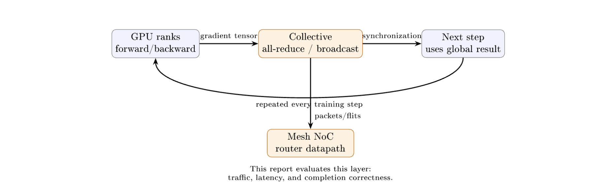
</p>

<p align="center"><em>Figure 1. GPU training、collective operation、Router datapath 与 Mesh NoC 的映射。</em></p>

所有性能比较均为 paired experiment：baseline 与 proposed design 使用相同的
topology、traffic realization、packet size、offered load 和 random seed。超时不算
成功；分析脚本会检查 pair completeness、有限数值、delivery metadata 与运行数。

## 2. Architecture and implementation

### 2.1 Tree multicast

Baseline Network Interface 为每个远程目的节点注入一份独立物理包。Tree
multicast 只注入一个携带 64-bit destination bitmap 的包；Router 根据 XY tree
计算需要的 child branches，并仅在选中的本地节点交付副本。

| Replicated-unicast baseline | Proposed tree multicast |
|:---:|:---:|
| 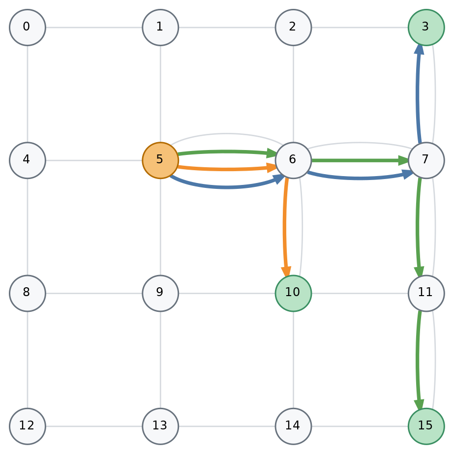 | 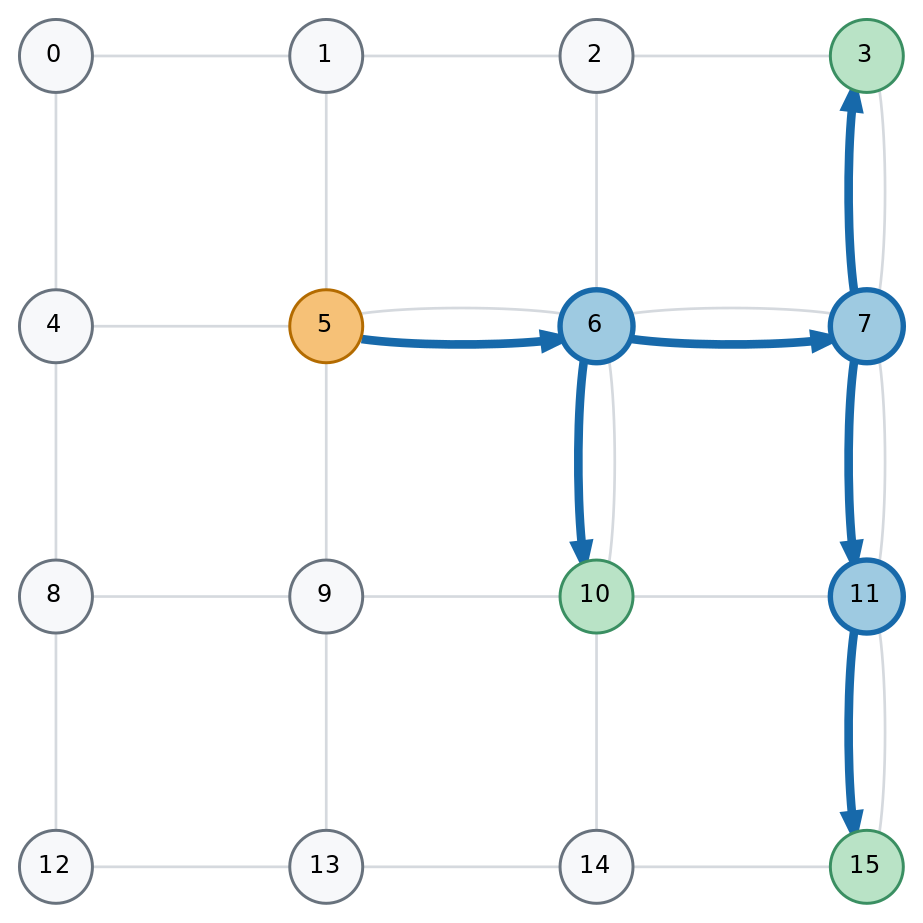 |

<p align="center"><em>Figure 2. 4×4 Mesh 上 replicated unicast 与 Router-side tree replication。</em></p>

实现支持：

- 任意目的集合和本地目的节点；
- 1、4、16、64-flit packets；
- 多 outstanding requests、有限 VC/buffer credit 与背景流量；
- head/body/tail branch state 和 atomic two-phase VC allocation；
- 精确检查目的集合、payload、flit order、missing/duplicate delivery。

Atomic fanout 保证所有分支一致前进，但一个受阻输出也会暂时阻塞其他输出；这正是
4×4、fanout 4 下少量 throughput regression 的来源。

### 2.2 Pressure-aware express-link bypass

`Mesh_Bypass` 在普通 Mesh 上增加双向 diagonal 或 dimension-aligned stride-2
links。Offline oracle 比较完整剩余路径的 modeled cycle cost，仅当 express path
严格更优时才写入 route table。运行时 admission 结合本地 free VC/credit、landing
Router pressure、hotspot state 和 packet length 决定是否使用 express hop。

| Phase-ordered diagonal | Multi-hop stride-2 |
|:---:|:---:|
| 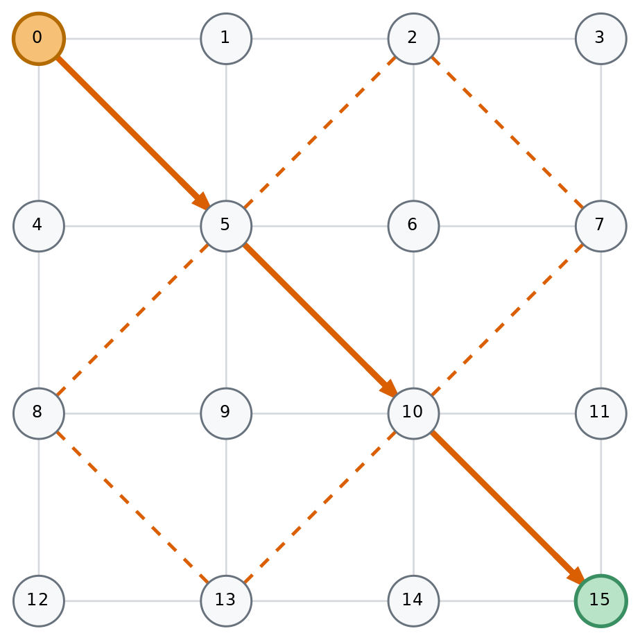 | 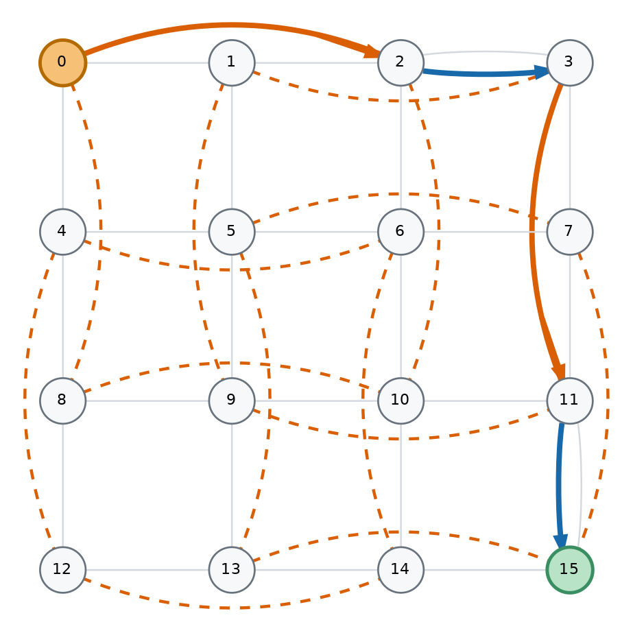 |

<p align="center"><em>Figure 3. 两种 4×4 bypass placement 与示例选路。</em></p>

静态路径和 runtime express-or-XY choice union 均通过 channel-dependency DAG
检查。评测采用 distance-scaled wire latency，并明确将 plain Mesh 作为低资源成本
baseline；结果不声称 iso-area、iso-power 或 physical timing closure。

### 2.3 Tensor all-reduce

Tensor packet 保留 multi-flit packet boundary，每个 flit 携带 lane identifier。
Router 按 `(collective_id, lane_id)` 聚合贡献，完成的 lane 在 output VC 不可用时进入
等待队列，因此 backpressure 不会丢失 reduction state。

<p align="center">
  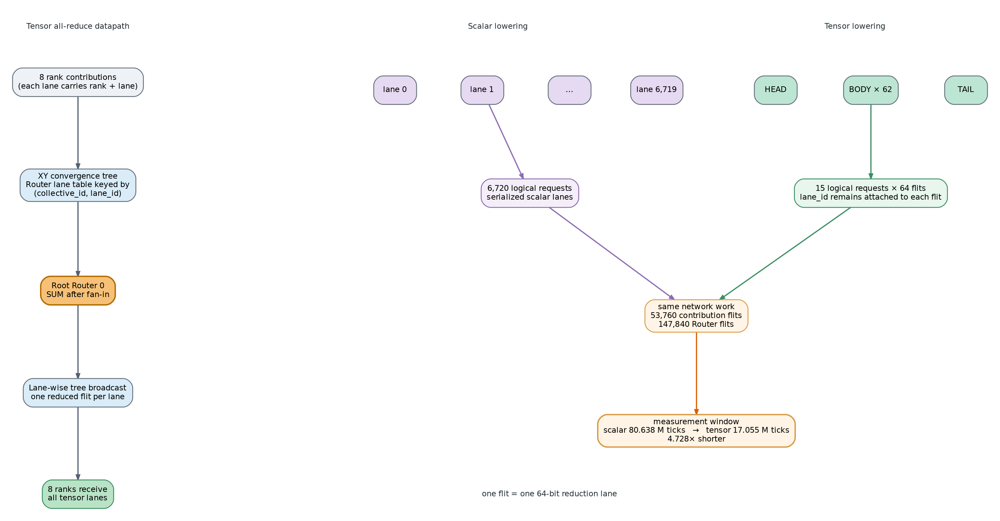
</p>

<p align="center"><em>Figure 10. 同一 H100 trace 的 scalar-lane 与 tensor lowering，以及保持不变的网络工作量。</em></p>

## 3. Evaluation results

### 3.1 Multicast results

Multicast correctness matrix 共 240 次 execution，即 120 个 mode-matched
comparison；performance study 共 432 个 matched cases。4×4 和 8×8 的共同
fanout 为 4/8/16，8×8 另评估 fanout 32/64。

| Mesh | Fanouts | Latency speedup | Internal-link flit reduction | Throughput change |
|---|---:|---:|---:|---:|
| 4×4 | 4, 8, 16 | 3.638× | 39.51% | +190.89% |
| 8×8 | 4, 8, 16, 32, 64 | 6.331× | 48.53% | +681.77% |

*Table 1. Multicast aggregate results。Latency 为 geometric mean；traffic 与
throughput change 为 matched cases 的 arithmetic mean。*

<p align="center">
  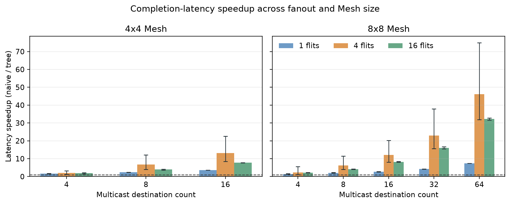
</p>

<p align="center"><em>Figure 4. 按 topology、fanout 和 packet size 分组的 multicast latency speedup。</em></p>

<p align="center">
  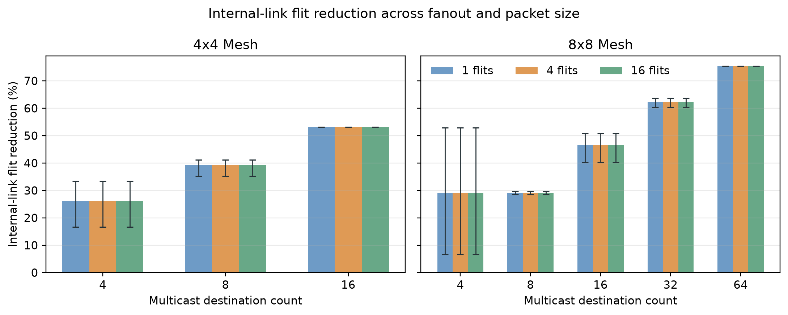
</p>

<p align="center"><em>Figure 5. Multicast internal-link flit reduction；packet size 不改变固定 tree 的路径共享比例。</em></p>

<p align="center">
  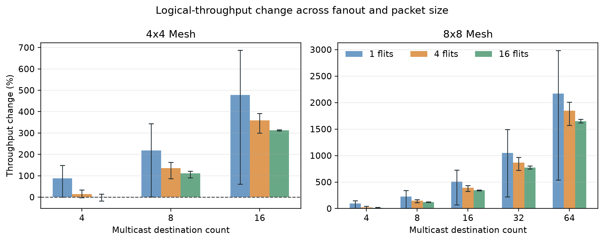
</p>

<p align="center"><em>Figure 6. Multicast logical-throughput change；高 fanout 收益最大，长包更易受到 atomic branch coupling 影响。</em></p>

共同 fanout 下，4×4/8×8 latency speedup 分别为 3.638×/3.472×；8×8 scale-out
在 fanout 64 达到 75.39% link-flit reduction、21.618× latency speedup 和
+1,888.29% mean throughput change。10 个 throughput regressions 全部位于 4×4、
fanout 4，worst case 为 −18.24%；8×8 没有 throughput regression。

### 3.2 Bypass results

4×4 和 8×8 均评估 uniform random、transpose、bit complement 和 50% hotspot；
packet size 为 1/4/16/64 flits，16 个 offered-load points，seeds 为 1/7/17。
每种 bypass family 包含 1,536 matched cases、3,072 次 gem5 runs。

<p align="center">
  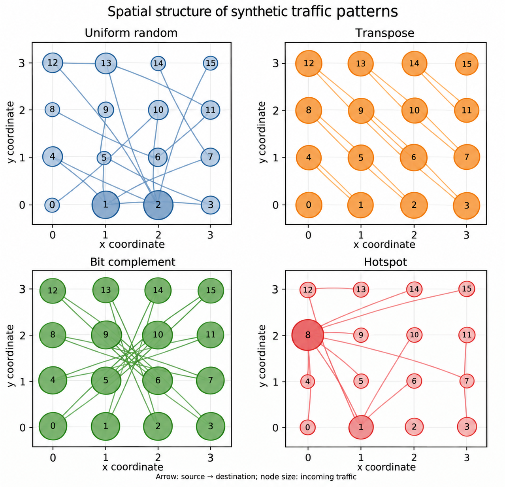
</p>

<p align="center"><em>Figure 7. Bypass 评测使用的四种 synthetic traffic pattern。</em></p>

| Topology | Mesh | Latency speedup | Throughput change |
|---|---:|---:|---:|
| Diagonal | 4×4 | 1.426× | +4.27% |
| Diagonal | 8×8 | 1.165× | +12.90% |
| Stride-2 | 4×4 | 1.312× | +4.37% |
| Stride-2 | 8×8 | 1.620× | +39.37% |

*Table 2. Distance-scaled bypass aggregate results。Latency 先在 packet size 内取
geometric mean，再按报告定义进行 traffic-pattern aggregation；throughput 为全部
matched cases 的 arithmetic mean。*

<p align="center">
  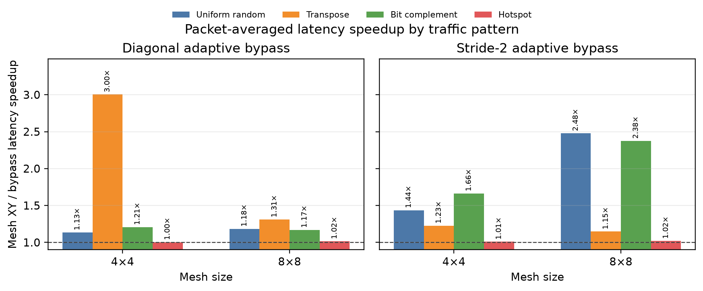
</p>

<p align="center"><em>Figure 8. 按 traffic pattern 分组的 packet-averaged bypass latency speedup。</em></p>

<p align="center">
  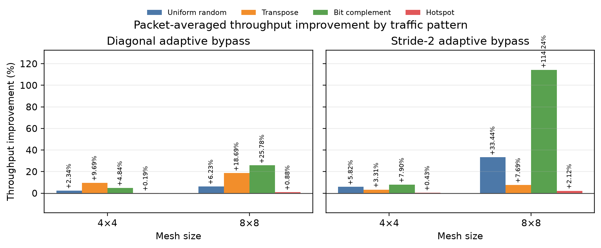
</p>

<p align="center"><em>Figure 9. 按 traffic pattern 分组的 packet-averaged bypass throughput improvement。</em></p>

Diagonal 最适合 transpose 几何结构，在 4×4 达到 3.004× latency speedup；
stride-2 可沿路径重复使用，随 Mesh diameter 增长更明显，在 8×8 bit complement
下达到 2.376× latency speedup 和 +114.24% throughput。Hotspot 的最终共享链路
仍是瓶颈，因此所有组合都接近 plain Mesh XY。

### 3.3 Scaled H100 trace replay

输入来自真实执行的 8×H100 80GB HBM3 NCCL microbenchmark。Replay 保留事件顺序
和 tensor size，并将 payload bytes 与相对 release time 按 1/1024 缩放；报告中的
时间是 simulation ticks，不是原生 H100/NVLink latency。

| Replay view | Trace events | Logical requests | Source flits | Window (ticks) |
|---|---:|---:|---:|---:|
| Broadcast | 15 | 30 | 6,720 | 17,047,500 |
| Scalar all-reduce | 15 | 6,720 | 53,760 | 80,638,000 |
| Tensor all-reduce | 15 | 15 | 53,760 | 17,054,500 |

*Table 3. Scaled H100 replay summary。Scalar 与 tensor all-reduce 注入和转发相同
数量的 flits，仅改变 request representation。*

Tensor packetization 将 replay window 从 80,638,000 缩短到 17,054,500 ticks，
即 **4.728× speedup**。两种表示均完成 53,760 rank-lane deliveries 和 147,840
Router-forwarded flits，lane ID 与 deterministic sum 完全一致。

## 4. Correctness and validation

完整 gate 覆盖：

- 11 个 legacy collective cases；
- 240 次 multicast executions / 120 个 mode-matched comparisons；
- 30-request H100 broadcast replay；
- 14 个 tensor correctness cases；
- 32 个 tensor backpressure cases；
- tensor trace replay 与 scalar/tensor paired comparison。

在当前源码和匹配的 gem5 binary 上，以上 **7/7 gates 全部通过**。此外，bypass
route/dependency、traversal 和 multi-flit/backpressure suites 分别通过 5、8、14 个
cases；最终报告保留 neutral 与 negative results，不将 synthetic/replay 结果外推到
完整训练系统。

## 5. Build and reproduce

从仓库根目录构建：

```bash
LD_LIBRARY_PATH=/path/to/python/lib \
  scons build/Garnet_standalone/gem5.opt -j32 PROTOC=/bin/false
```

运行完整功能 gate：

```bash
LD_LIBRARY_PATH=/path/to/python/lib \
  python3 tests/gem5/lab4/run_lab4_full_gate.py --jobs 32
```

运行 multicast performance study：

```bash
LD_LIBRARY_PATH=/path/to/python/lib \
  python3 tests/gem5/lab4/run_multicast_performance.py \
    --output report/raw-results/multicast-4x4-8x8 --jobs 32
```

运行最终 distance-scaled stride-2 bypass study：

```bash
LD_LIBRARY_PATH=/path/to/python/lib \
  python3 tests/gem5/lab4/run_bypass_performance.py \
    --families stride --wire-models distance_scaled \
    --bypass-adaptive-routing --bypass-adaptive-policy conservative \
    --bypass-adaptive-max-packet-flits 32 \
    --output report/raw-results/refinement-v3-full --jobs 32
```

验证 trace inputs：

```bash
python3 tests/gem5/lab4/test_ai_trace_tools.py
python3 util/lab4_trace/validate_trace.py traces/h100_8gpu_collectives.json
python3 util/lab4_trace/validate_replay.py traces/h100_8gpu_broadcast_replay.json
python3 util/lab4_trace/validate_replay.py traces/h100_8gpu_allreduce_replay.json
python3 util/lab4_trace/validate_replay.py traces/h100_8gpu_tensor_allreduce_replay.json
```

重建报告 figures 与 PDF：

```bash
python3 report/scripts/plot_multicast.py
python3 report/scripts/plot_bypass_topology.py
python3 report/scripts/build_final_report_data.py
python3 report/scripts/generate_architecture_figures.py

pdflatex -interaction=nonstopmode -halt-on-error \
  -output-directory=report report/ai_collectives_report.tex
pdflatex -interaction=nonstopmode -halt-on-error \
  -output-directory=report report/ai_collectives_report.tex
```

大规模 raw simulator outputs 因体积原因不提交；compact CSV/JSON、manifest、source
hash 和生成后的 figures 保留在 `report/`。详细 snapshot 与 artifact provenance 请见
[report/README.md](report/README.md)。

## 6. Main source locations

- `configs/topologies/Mesh_Bypass.py`：express-link topology construction；
- `configs/topologies/bypass_oracle.py`：cycle-aware route table 与 dependency audit；
- `src/mem/ruby/network/garnet/Router.cc`：multicast replication 与 tensor reduction；
- `src/mem/ruby/network/garnet/RoutingUnit.cc`：bypass route selection/admission；
- `src/mem/ruby/network/garnet/NetworkInterface.cc`：collective injection/ejection；
- `tests/gem5/lab4/`：correctness、performance、backpressure 与 replay runners；
- `util/lab4_trace/`：H100 trace capture、lowering 与 validation；
- `report/scripts/`：统计验证和 figure generation。

## 7. Division of labor

| Member | Contributions |
|---|---|
| Chunyu Liu | Stride-2 bypass；tree multicast；H100 trace capture/compilation；report/slides；presentation |
| Boyan Pu | Diagonal bypass；tensor all-reduce；backpressure/correctness validation；report/slides |

## 8. Scope and limitations

- Multicast destination bitmap 将一个 collective domain 限制为最多 64 Routers；
- atomic branch allocation 可能产生 head-of-line coupling；
- bypass 是 added-resource comparison，不是 iso-area/iso-power comparison；
- wire delay、port/buffer 数量使用 Garnet proxy，未进行 RTL timing closure 或能耗建模；
- H100 trace 是执行过的 collective microbenchmark，不是完整 model-training trace；
- tensor reduction 未建模有限 accumulator capacity 和 arithmetic latency。
