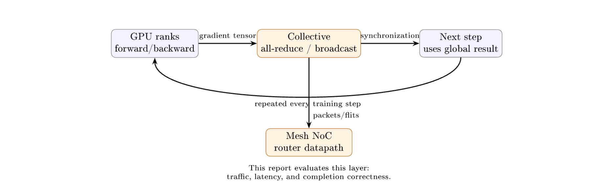
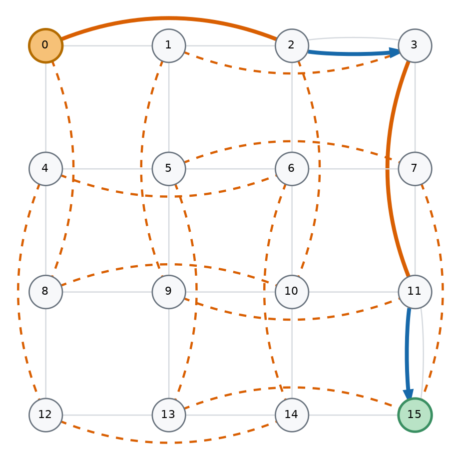
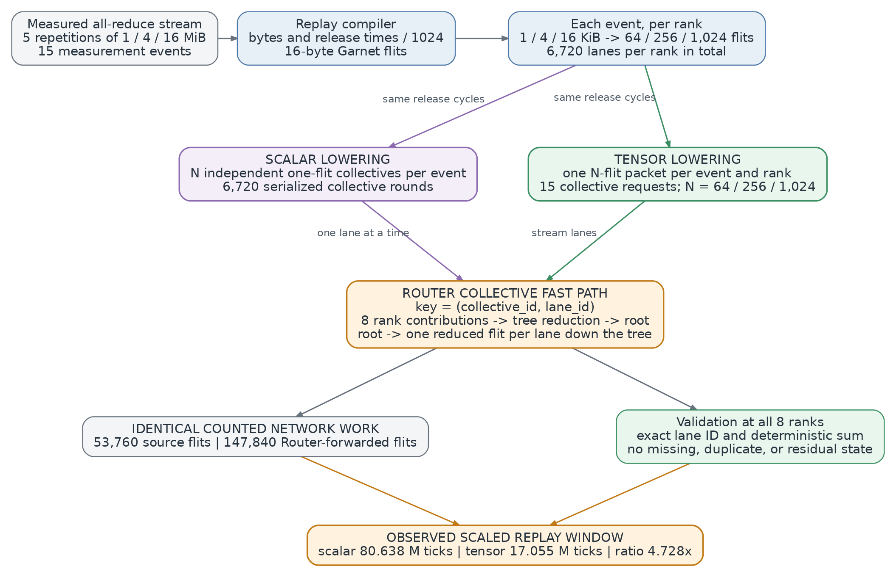
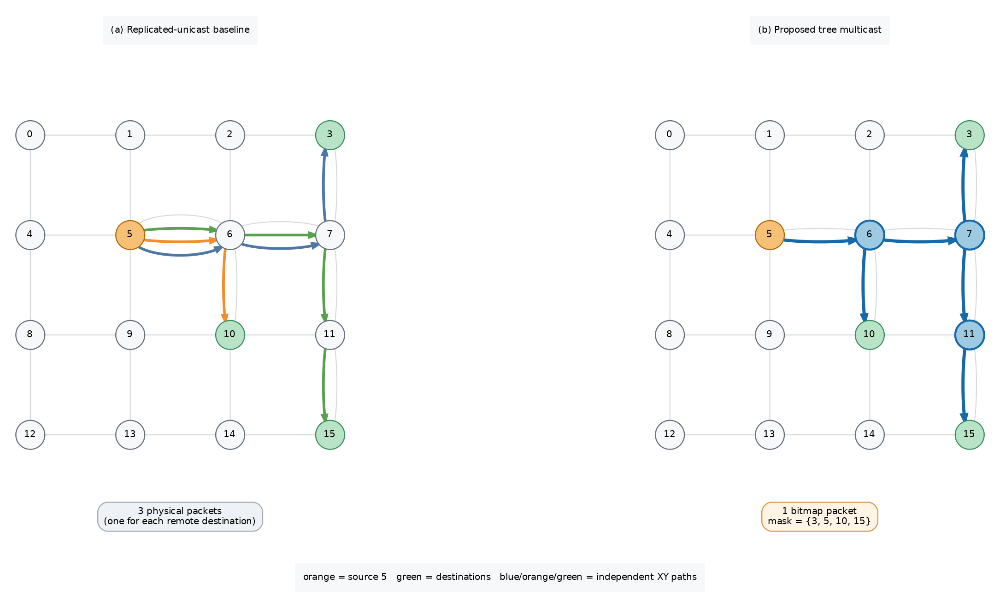
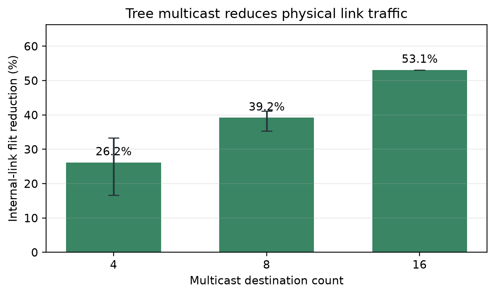
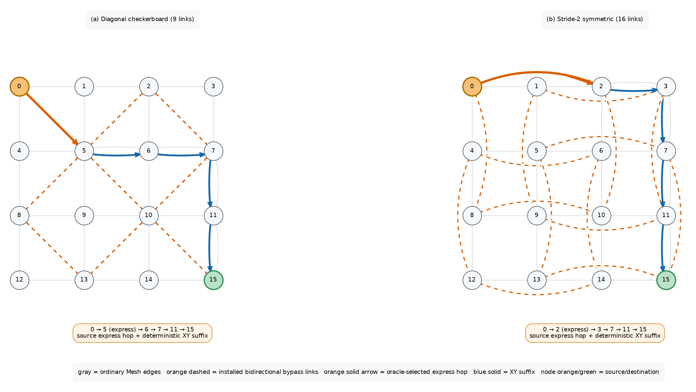
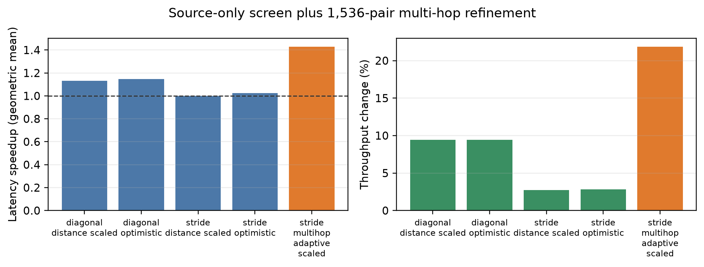
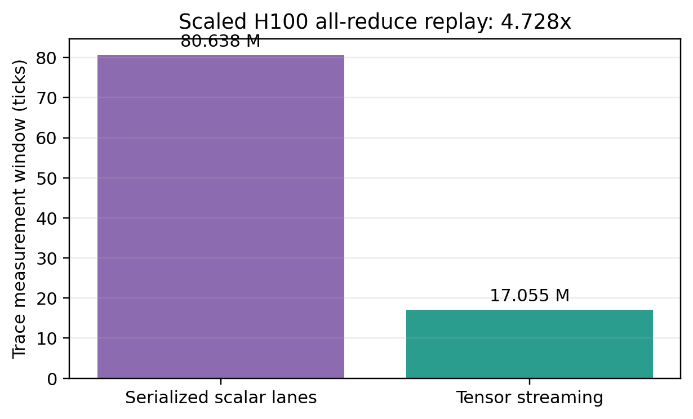

# ai_collectives_20260907_20260907_061611

- Source: `ai_collectives_20260907_20260907_061611.pptx`
- Total slides: 11

## Slide 1

Collective-Aware Router Microarchitecturein gem5 GarnetMulticast, Express-Link Bypass, and Tensor All-Reduce

- Chunyu Liu and Boyan Pu
- September 7, 2026

### Speaker Notes

Today I will present our collective-aware Router microarchitecture in gem5 Garnet. The central idea is to preserve communication structure that conventional packet networks usually discard, using tree multicast, express-link bypass, and event-level tensor all-reduce.

## Slide 2

Why Collectives Matter to the Network

 GPU training repeatedly alternates computation with global collective communication.

 Packetization usually discards group and tensor structure.

 Can Router logic preserve it to reduce traffic and latency?

### Speaker Notes

Large-scale GPU training repeatedly alternates local computation with global synchronization. Ranks produce gradient tensors, exchange them through collectives such as broadcast and all-reduce, and wait before the next training step can begin. Once those operations enter a conventional network, their group and tensor structure is often reduced to unrelated packets and destinations. Our question is whether a Router datapath that retains this structure can reduce traffic and latency while preserving exact delivery and completion. We study that question at the Mesh network layer in cycle-level gem5 Garnet.

## Slide 3

Three Structure-Aware Mechanisms

 Preserve communication structure at three complementary levels.

 Each mechanism is evaluated against a workload-matched baseline.

1 Tree Multicast

2 Express Bypass

3 Tensor Streaming

### Speaker Notes

The work exposes structure at three complementary levels. Tree multicast shares common route prefixes instead of injecting one physical packet for every destination. Express-link bypass changes the topology and routing policy so selected packets can skip Router stages when the full modeled path becomes cheaper. Tensor streaming retains an all-reduce event as one multi-flit collective request rather than thousands of scalar-lane rounds. Each mechanism is evaluated against a workload-matched baseline, with traffic, latency, throughput, or replay window chosen according to the mechanism being tested.

## Slide 4

Tree Multicast: Share Common Route Prefixes

 Baseline: one unicast packet per remote destination.

 Tree packet: one 64-bit destination bitmap.

 Routers replicate only at pruned-tree branch points.

 Head, body, and tail retain per-branch VC state.

 Atomic fanout: all outputs must have credit.

 Exact delivery, but blocked branches stall all copies.

Compared on the same 4×4 Mesh and destination sets.

### Speaker Notes

For multicast, the baseline Network Interface injects one unicast packet for every remote destination. Our alternative injects a single packet carrying a sixty-four-bit destination bitmap, and each Router replicates only where the pruned XY tree branches. Head, body, and tail flits retain per-branch virtual-channel state so every selected destination receives one complete packet. Allocation is atomic: all required outputs must have a free virtual channel, and a flit advances only when every selected branch has credit. This guarantees exact delivery, but it also couples fast branches to the slowest congested branch.

## Slide 5

Multicast Results: Less Traffic, One Tradeoff

39.51%

mean internal-link flit reduction

3.638×

geometric-mean latency speedup

10 / 162 regressions

all at fanout 4; worst throughput −18.24%

### Speaker Notes

Across one hundred sixty-two matched performance pairs, tree multicast reduces internal-link flit arrivals by thirty-nine point five one percent on average. The reduction grows monotonically with fanout, reaching fifty-three point one three percent for sixteen destinations. Geometric-mean latency speedup is three point six three eight times, and all paired latency values improve, although this includes the dedicated collective datapath as well as shared-prefix replication. Mean throughput also rises strongly, but ten four-destination cases regress, with a worst change of minus eighteen point two four percent. Those cases expose the cost of atomic branch synchronization under low-fanout congestion.

## Slide 6

Express-Link Bypass: Shorter Paths with Guardrails

 Topology: bidirectional stride-2 physical links.

 Wire latency scales with Manhattan span.

 Oracle: choose an express hop only if full

suffix cycle cost decreases.

 Reconsult the table at every Router for multi-hop use.

 Runtime guard: fall back to XY under pressure.

Static routes pass a channel-dependency DAG audit.

Runtime choices preserve monotonic X-before-Y progress.

### Speaker Notes

The bypass design adds bidirectional stride-two physical links to the Mesh, with link latency scaled by Manhattan span. Before simulation, an oracle materializes deterministic X-then-Y routes and selects an express edge only when it lowers the cycle cost of the complete remaining path. Unlike the earlier source-only design, the final policy reconsults this table at every Router, allowing several monotonic express hops. For unordered traffic, a conservative runtime guard falls back to ordinary XY when the express or landing output is blocked, materially more congested, or associated with a sustained hotspot. Static paths pass a channel-dependency audit, while runtime safety follows from strict dimension-order progress.

## Slide 7

Bypass Results: Multi-Hop Routing Matters

1.430×

geometric-mean latency speedup

+21.87%

mean throughput across 1,536 pairs

0.909× worst case

only one regression larger than 5%

Source-only stride routing: 0.999×

Added links, ports, and buffers — not an iso-resource comparison.

### Speaker Notes

Over one thousand five hundred thirty-six workload-matched pairs, the final distance-scaled multi-hop design achieves a one point four three zero times geometric-mean latency speedup and a twenty-one point eight seven percent mean throughput increase. Its median speedup is one point zero eight two, and only one case regresses by more than five percent; the worst case is zero point nine zero nine under hotspot traffic. The comparison against source-only routing is important: the same stride topology is essentially neutral at zero point nine nine nine times. Physical links alone therefore do not explain the gain. These are added-resource results, because the bypass Mesh has more links, ports, virtual channels, and buffers than plain Mesh XY.

## Slide 8

H100 Trace: Preserve the Event, Not Scalar Lanes

 15 measured eight-H100 all-reduce events at 1, 4, and 16 MiB.

 Bytes and release times are scaled by 1/1024 for tractable replay.

 Scalar: 6,720 one-flit rounds.

 Tensor: 15 multi-flit requests.

### Speaker Notes

The trace case study reconnects these mechanisms to measured eight-H100 collectives. We select fifteen all-reduce events at one, four, and sixteen mebibytes, then scale both bytes and relative release times by one over one thousand twenty-four for tractable Garnet replay. Scalar lowering represents the events as six thousand seven hundred twenty independent one-flit collective rounds. Tensor lowering instead creates one multi-flit packet per event and rank, with a lane identifier on every flit. Both paths use the same lane-wise Router reduction, routes, release schedule, and arithmetic, so the manipulated variable is request representation.

## Slide 9

Tensor Replay: Same Work, 4.728× Shorter Window

 Replay window falls from 80.638M to 17.055M ticks.

 4.728× improvement on both evaluated topologies.

 Same 53,760 source and 147,840 Router-forwarded flits.

The gain comes from request representation, not less counted network work.

### Speaker Notes

Event-level tensor packetization shortens the replay window from eighty point six three eight million to seventeen point zero five five million ticks, a four point seven two eight times improvement on both evaluated topologies. Crucially, the scalar and tensor representations inject the same fifty-three thousand seven hundred sixty source flits and forward the same one hundred forty-seven thousand eight hundred forty Router flits. All lane identifiers, deterministic sums, and accumulator releases also match. The improvement therefore comes from replacing thousands of independently admitted scalar rounds with fifteen event-level requests, not from reducing counted network work.

## Slide 10

Takeaway: Expose Collective Structure

 Share paths: remove duplicated multicast transport.

 Shorten paths: pressure-aware stride links help most under load.

 Preserve requests: tensor packets avoid scalar-lane serialization.

Limits: added bypass resources, scaled H100 trace, and atomic fanout coupling.

### Speaker Notes

The common lesson is that the network benefits when collective structure remains explicit. Tree replication shares multicast prefixes, pressure-aware stride routing skips Router stages when doing so is genuinely cheaper, and tensor requests avoid scalar-lane serialization. The boundaries are equally important: atomic multicast can couple branches, bypass gains require added hardware and are not iso-resource, and the H100 trace is scaled rather than a native end-to-end training run. Within those limits, the experiments show consistent value from exposing communication semantics to the Router datapath instead of flattening them at injection.

## Slide 11

Thank You — Questions?

- Chunyu Liu and Boyan Pu
- Collective-Aware Router Microarchitecture

### Speaker Notes

Thank you for listening. We welcome your questions about the microarchitecture, evaluation methodology, or the observed tradeoffs.
